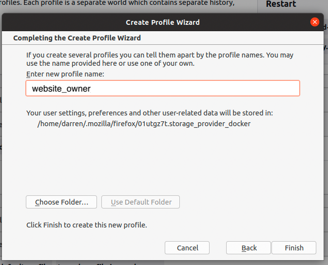
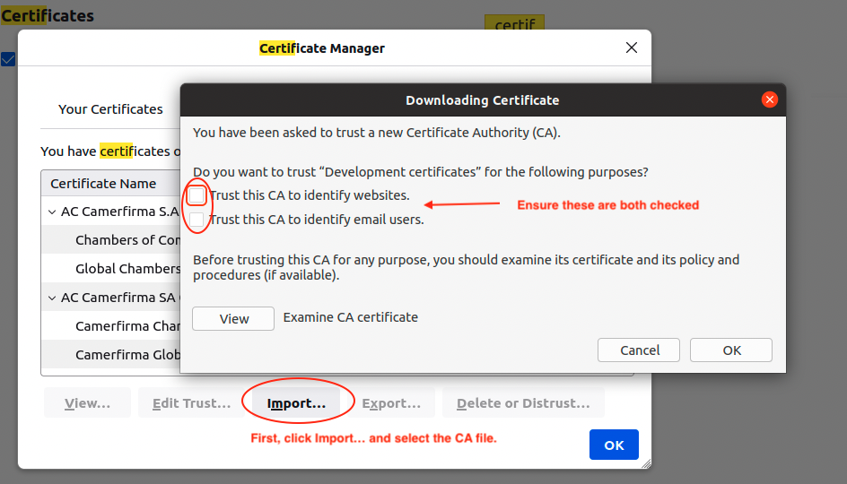

Welcome to the builder's section of the Point Network Wiki.

## Installing Docker

This setup requires Docker installed. We will not go into the details here as there are several resources online that can help. The important things are to install the correct versions to be able to run `docker` without using `sudo` and to have the `docker compose` sub command available.

### Versions

If you already have Docker and Docker Compose installed, confirm that the versions are the following (or higher). Check against these versions below:

```
docker --version
>> Docker version 20.10.12, build e91ed57

docker compose version
>> Docker Compose version v2.2.3
```

### Install Docker Engine on Mac, Linux and Windows

Please follow the official [Docker installation instructions](https://docs.docker.com/engine/install/).

**NOTE**: If you are an **M1 Mac user** you will need to add this line to your `bash_profile`. Details [here](https://hublog.hubmed.org/archives/002027)

```
export DOCKER_DEFAULT_PLATFORM=linux/amd64
```

### Install Docker Compose as a plugin on Ubuntu

If you are running Linux (Ubuntu) and do not have the `docker compose` command available after installing docker then following [these instructions](https://www.digitalocean.com/community/tutorials/how-to-install-and-use-docker-compose-on-ubuntu-20-04).

### Run Docker without using sudo on Ubuntu

If you want to avoid typing sudo whenever you run the docker command, add your username to the docker group:

```bash
sudo usermod -aG docker ${USER}
```

To apply the new group membership, log out of the server and back in, or type the following:

```bash
su - ${USER}
```

More details in [this article](https://www.digitalocean.com/community/tutorials/how-to-install-and-use-docker-on-ubuntu-20-04).

### Develop using docker compose

First add some aliases and functions to your local bash environment. The project comes with a [`.bash_alias`](https://github.com/pointnetwork/pointnetwork/blob/develop/.bash_alias) file that contains a set of aliases that are useful for this project. The quickest way to add these alias to your terminal session is to run `source .bash_alias`.

**Recommended** You can also copy the contents of the `.bash_alias` into your `~/.bash_profile` file and then run `source ~/.bash_profile` that way these alias commands **will be available in every terminal session** going forward.

Clone the pointnetwork repo, cd into and install deps like so:

```bash
git clone git@github.com:pointnetwork/pointnetwork.git
cd pointnetwork
nvm use
npm i
npm run build
```

Next, copy the *.env.e2e.example* file to *.env.e2e*:

```bash
cp .env.zappdev.example .env.zappdev
```

You need to build a local Docker image to use. Ensure you are on the branch you want to work from and run the following command to build your new Docker image. NOTE: You may need to wait a few minutes for the image build to complete!

```bash
build-image
```

### Build and Deploy Zapps

Point Network Example Zapps live in their own separate repo called [Zapps](https://github.com/pointnetwork/zapps). Clone this repo to any location you like on your computer and proceed with the instructions below. In this tutorial we will assume that you have cloned the Zapps repo to a folder **one level below pointnetwork** repo. If you want to clone to a different location that is fine - you just need to change the relative paths below to your path (you will also need to modify the volume mount in `docker-compose.zapdev.yaml` and since this file is committed to the repo its not recommended).

NOTE: Since PointSocial Zapp uses React JS we need to make sure that the site is built locally first. For other Zapps you can check if dependencies are required and you only need to run `npm i`. 

```bash
cd ../zapps/social.point
npm i
npm run build       <-- only needed for building Zapps that use frontend libraries like React JS
```

In one terminal start all the services and watch the `point_node` logs (NOTE: run these commands *from the root* of the cloned pointnetwork repo!)

```bash
dclean
point-zappdev up -d
point-zappdev logs -f point_node
```

In another terminal (to connect to the `point_node` node and deploy the site )

```bash
dexec point_node
 ./point deploy example/social.point --contracts
```

The site should deploy successfully after a few minutes.

### Troubleshooting the deployment

If you see the following error:

```bash
Error: Could not find contract dependency, have you tried npm install?
```

Then it's likely that the Zapp you are attempting to deploy is missing dependencies required for the deployment or for the runtime. To fix this, it's best to stop the Point Node running, install the Zapp dependencies using `npm i` and then restart the node and try again.

If you see the following error:

```bash
Error: >>>>>>>>>>>>>>>>>>>>>>>> SOLIDITY COMPILATION ERRORS <<<<<<<<<<<<<<<<<<<<<<<<
Internal exception in StandardCompiler::compile: /solidity/libsolidity/interface/CompilerStack.cpp(104): Throw in function solidity::frontend::CompilerStack::CompilerStack(ReadCallback::Callback)
Dynamic exception type: boost::wrapexcept<solidity::langutil::InternalCompilerError>
std::exception::what: You shall not have another CompilerStack aside me.
[solidity::util::tag_comment*] = You shall not have another CompilerStack aside me.
```

... then it is usually due to installing dependencies after the Point Node has started. A simple restart of the Point Node should fix this.

### Open the deployed site in Point Browser

First create two profiles in Firefox to be able to test connecting to the different nodes quickly and easily. I suggest creating two profiles matching the names of the profiles set in your bash alias as mentioned above. NOTE: these profiles only need to be created once.

### Create a Point Network Profile in Firefox

1. Create a new Profile by navigating to `about:profiles` in Firefox.

|  |
| ------------------------------------- |

2. Enter the profile name in the wizard

Note we need to create two profiles so set the name to the profile you are currently creating

* `website_owner_docker`
* `website_visitor_docker`

|  |
| ------------------------------------- |

3. Configure the proxy for the specific profile

Note each profile that you are creating requires a specific proxy setting. Please configure as shown below based on the profile you are currently adding:

* Profile `website_owner_docker` : set proxy to `localhost:65501`
* Profile `website_visitor_docker` : set proxy to `localhost:65502`

|  |
| ------------------------------------- |

4. Import **and trust** the Point Network CA Certificate

Note the Point Network CA certificate is located in the [`resources/certs`](https://github.com/pointnetwork/pointnetwork/tree/develop/resources/certs) directory.

|  |
| ------------------------------------- |


Now clone the [PointSDK](https://github.com/pointnetwork/pointsdk) repo into a *separate directory*, cd into it, use the correct node version, install web-ext and run the `point-browser-owner` alias command like so:

```bash
git clone git@github.com:pointnetwork/pointsdk.git
cd pointsdk
nvm use
npm i -g web-ext
point-browser-owner
```

This should open the Point Browser with the `website_owner_docker` profile already configured to connect to the `point_node` node and open [https://point](https://point). Now you can navigate to [https://point/identities](https://point/identities) and you should see the deployed pointsocial.point zapp listed, You can open it from there.

### Open the deployed site in a second Point Browser

To test out interacting between different Point Network identities we can open another Point Browser, for example the `website_visitor` like so (from the root of the pointsdk repo):

```bash
cd pointsdk
point-browser-visitor
```

If you have added the above command as an alias and you have set up the Firefox profile you should see a new browser open that is connected to the `website_visitor` node. You can now post messages between each other on pointsocial!

### Next steps

Try to deploy the `store.point` app. To do so its just a matter of:

1. Install the deps in store.point `cd ../zapps/store.point && npm i`
1. Build the store.point site `cd ../zapps/store.point && npm run build`
1. Tear down all the services (from the project root) `point-zappdev down`
1. Clean all Docker containers and volumes `dclean`
1. Bring up all the services (from the project root) `point-zappdev up -d`
1. Connect back into the `point_node` running container: `dexec point_node`
1. Deploy store.point: `./point deploy example/store.point --contracts`
1. Open a Point Browser instance to [https://store.point](https://store.point)

### Deploy your own website

1. Copy your website to `example` folder.
1. If your website uses `yarn`/`npm`, install dependencies and build it.
1. Before deployment, your website should contain `public` folder with all the static files.
1. If you use solidity contracts, which have to be deployed, they should be in `contracts` folder.
1. Create `point.deploy.json` file in your website folder root. It should contain version, target url, list of contracts and keyvalue entries. Use some of existing website's files as an example.
1. Create `routes.json` file. If your app is an SPA, it should contain the only route: `"/": "index.html"` (or whatever is your index file name). If your app is a traditional static website, add all the routes with the corresponding file names.
1. Repeat 3-8 steps of the previous tutorial (changing `store` to your website name in step 7).

**Docker Compose Logs**

To follow the logs of *all* the containers simply run `point-zappdev logs -f` in the terminal. If you want to follow the logs of a specific container, then specify the service name as well like so: `point-zappdev logs -f point_node` (to follow the logs of `point_node`)

**Docker Compose and Truffle Console**

Since the `blockchain_node` service is exposed via `http://localhost:7545` its therefore possible to use the truffle console without any modification.

Therefore, *from the root* of the cloned pointnetwork repo, you can run:

```bash
 cd truffle
 truffle console
 ```

 The above will connect to the running Ganache blockchain in the Docker `blockchain_node` service.

 **Docker complete database reset**

 There is a simple command in the alias list above that will tear down all services, remove orphaned containers and remove all volumes. *Only run this command if you are ok with it clearing out your Docker volumes etc*. Check the alias for its exact functionality. The command run is:

 ```bash
 dclean
 ```

### Coding style

Following coding style applies:

* Always use semicolons otherwise [dragons may bite you](https://www.freecodecamp.org/news/codebyte-why-are-explicit-semicolons-important-in-javascript-49550bea0b82/)!
* Use 4 spaces as a default indent for all files and set this in your IDE.

